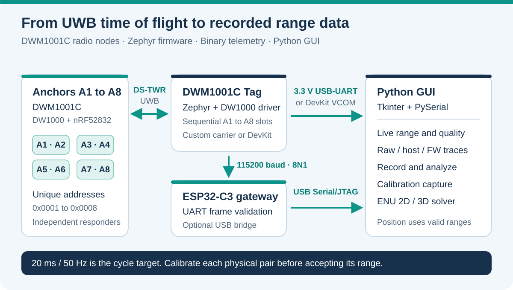

# DWM1001 UWB Ranging System

**DWM1001C + Zephyr | Eight-anchor ranging | ESP32-C3 bridge | Python ground control**

[English](#english) · [Tiếng Việt](#tieng-viet) · [Firmware guide](Firmware/README.md) · [GUI guide](Software/UWB_UART_GUI/README.md)

<a id="english"></a>

## English

This repository develops a UWB ranging system around the DWM1001C module, which combines a DW1000 radio and an nRF52832 MCU. A Tag polls eight independently addressed Anchors; telemetry reaches a Python desktop GUI through an ESP32-C3 gateway, a 3.3 V USB-UART adapter, or the DWM1001-DEV virtual COM port.

The project includes firmware, range filtering, recording, calibration and experimental 2D/3D localization. Drone integration is a future application described in `Plan/`, rather than a verified flight-control capability.

> [!IMPORTANT]
> Current Tag profiles set `UWB_DS_CALIBRATED_MASK = 0`. Measurements marked `CAL_MISSING` are calibration diagnostics with `valid = false`. Calibrate each physical Tag/Anchor pair and validate it on hardware before using its range for control.

### Architecture and current configuration



| Layer | Behavior in the current source |
|---|---|
| Radio | Channel 5, PRF 16 MHz, preamble 256, PAC16, standard SFD, 6.8 Mbps PHY |
| Ranging | DS-TWR: `POLL -> RESP -> FINAL -> REPORT`, with SS fallback when applicable |
| Node identities | Tag `0x0000`; Anchors `0x0001` through `0x0008`; PAN `0xDECA` |
| Scheduler | A1 through A8 in a nominal 20 ms cycle; offline-anchor probing/backoff |
| Driver | Register-level DW1000 operations through Zephyr SPI/GPIO; 40-bit timestamps and delayed TX |
| Telemetry | UART0, 115200 baud, 8N1; binary INFO/RANGE/STATS frames with CRC |
| Host | Tkinter GUI, PySerial decoder, independent host filter, analysis and session recorder |

The **50 Hz cycle rate and up to 400 successful ranging operations/s are design targets**. Actual rates depend on radio response, missing Anchors, timeouts and overruns. Inspect `cycle_hz`, `operation_hz`, timeout and overrun counters during a run. This README does not claim a verified eight-node rate, accuracy, range, NLOS performance or flight readiness.

### Repository map

| Path | Purpose |
|---|---|
| [`Firmware/Tag/`](Firmware/Tag/README.md) | Tag for the custom `RangingSystemClassic` carrier; LED P0.12 |
| [`Firmware/Tag_DevKit/`](Firmware/Tag_DevKit/README.md) | Separate DWM1001-DEV Tag profile; D9 LED and on-board J-Link VCOM |
| `Firmware/Anchor_1/` through `Firmware/Anchor_8/` | Eight existing responder projects, each with its own short address |
| [`Firmware/ESP32C3_Gateway/`](Firmware/ESP32C3_Gateway/README.md) | ESP-IDF UART-to-USB binary telemetry bridge |
| [`Firmware/tests/`](Firmware/tests/) | C driver/state-machine tests and Python project-consistency checks |
| [`Software/UWB_UART_GUI/`](Software/UWB_UART_GUI/README.md) | GUI, protocol parser, recorder, filters, analysis and tests |
| [`Firmware Code Base/`](Firmware%20Code%20Base/README.md) | Earlier shared/Kconfig reference with its own configurations and calibration history |
| [`Plan/`](Plan/) | Development plans and proposed drone integration |

Use the role-specific projects under `Firmware/` for current work. The reference copy and the active projects contain duplicated code; changes do not propagate automatically. Do not transfer calibration constants between the reference, custom carrier and DevKit profiles without new measurements.

### Hardware and pinout

Start with one Tag, one Anchor and an appropriate SWD probe. Add labeled Anchors as bring-up progresses. Use common ground and 3.3 V serial logic.

| Connection | nRF52832 pin | Destination / purpose |
|---|---|---|
| Tag UART TX | P0.05, module pin 20 | ESP32-C3 GPIO20 RX or USB-UART RX |
| Tag UART RX | P0.11, module pin 18 | ESP32-C3 GPIO21 TX; reserved command path |
| RDY | P0.26, module pin 19 | ESP32-C3 GPIO10 input; reserved handshake |
| Carrier status LED | P0.12 | Active-high; DevKit instead uses D9/P0.30, active-low |
| Internal DW1000 SPI2 | SCK P0.16, MOSI P0.20, MISO P0.18, CS P0.17 | Internal radio bus |
| Internal DW1000 control | IRQ P0.19, RESETn P0.24 | Radio interrupt and reset |
| GND | GND | Common ground between connected devices |

SPI initialization uses 2 MHz and the configured fast rate is 8 MHz. External SPI1 is disabled in the overlays; it is separate from the internal DW1000 bus. Anchor overlays disable UART0. RDY and the reverse UART connection are not an implemented host-command interface. See the [hardware compatibility guide](Firmware/HARDWARE_COMPATIBILITY.md) for carrier wiring.

### Build and flash

The Windows helpers target **nRF Connect SDK v3.4.0** and board `decawave_dwm1001_dev/nrf52832`. Install a complete SDK west workspace and matching toolchain first. This repository is an application checkout and does not contain a `west.yml` manifest.

From the repository root, initialize the supplied environment helper:

```powershell
# Set these to your installed SDK and matching toolchain bundle.
$env:NCS_SDK_ROOT = 'C:\ncs\v3.4.0'
$env:NCS_TOOLCHAIN_ROOT = 'C:\ncs\toolchains\YOUR_BUNDLE'
. .\Firmware\scripts\ncs_env.ps1
$ncsEnvironment = Initialize-NcsEnvironment
west --version
.\Firmware\scripts\build_all.ps1
```

`build_all.ps1` builds the custom-carrier Tag and all eight Anchors. It excludes the DevKit Tag and ESP32-C3 gateway. The helpers temporarily map `Firmware/` to `U:` for Windows path handling and remove mappings they create; an unrelated occupied `U:` causes an error. Each node produces `build/zephyr/zephyr.hex` inside its project directory.

Build and flash individual boards after checking their physical labels:

```powershell
.\Firmware\Anchor_1\scripts\build.ps1
.\Firmware\Anchor_1\scripts\flash.ps1
.\Firmware\Tag\scripts\build.ps1
.\Firmware\Tag\scripts\flash.ps1
# Alternative Tag profile for a DWM1001-DEV evaluation board:
.\Firmware\Tag_DevKit\scripts\build.ps1
.\Firmware\Tag_DevKit\scripts\flash.ps1
```

The custom-carrier flash helpers call `west flash` using the board runner and require a compatible connected probe. The DevKit has its own J-Link setup. For other Anchors use the corresponding `Anchor_N` scripts; A2 through A8 already exist. Follow the [deployment guide](Firmware/ANCHOR_DEPLOYMENT.md) for module labeling and calibration.

Build the gateway separately in an ESP-IDF terminal:

```powershell
Set-Location .\Firmware\ESP32C3_Gateway
idf.py set-target esp32c3
idf.py build
idf.py -p COM7 flash   # Replace COM7 with the connected gateway port.
```

The gateway validates the incoming stream and re-encodes accepted frames for USB Serial/JTAG. USB output is reserved for binary telemetry. Close serial monitors before opening the GUI. USB backpressure can cause forwarding failures/drops, visible as sequence gaps; gateway counters are available in a debugger. Hardware build/flash and throughput must be verified with your ESP-IDF installation and board.

### Run the Python GUI

The supplied launchers use Python 3.12, Tkinter and `pyserial>=3.5,<4`. From the repository root:

```powershell
Set-Location .\Software\UWB_UART_GUI
py -3.12 -m pip install -r requirements.txt
.\run_gui.ps1
# Synthetic telemetry for trying the interface without hardware:
.\run_demo.ps1
```

Select the gateway, USB-UART or DevKit COM port, keep the baud at **115200**, and click **Kết nối** (Connect). Keep `TELEM_ASCII = 0` in the selected Tag profile. ASCII `R2` output is a separate bring-up format and is not the GUI's binary input.

The GUI shows A1 through A8, raw/firmware/host filtered traces, status, age, FPP, INFO profiles and parser counters. It supports ENU Anchor layouts in metres, range-based 2D/3D solving, statistical analysis and calibration capture. A recording includes `range.csv`, `stats.csv`, `uart.csv`, `info.jsonl`, `events.log`, CRC-validated `raw_telemetry.bin`, layout and session metadata. See the [GUI guide](Software/UWB_UART_GUI/README.md) for recording and EXE packaging.

### UART protocol and units

All multibyte fields are little-endian. The framing contract is shared by the [Tag telemetry header](Firmware/Tag/include/telemetry.h) and [Python decoder](Software/UWB_UART_GUI/telemetry_protocol.py).

```text
AA 55 | VER:u8=1 | TYPE:u8 | LEN:u16 | SEQ:u32 | TIME_MS:u32
      | PAYLOAD:LEN bytes | CRC16:u16
```

CRC-16/CCITT-FALSE uses polynomial `0x1021`, initial value `0xFFFF`, and covers `VER` through the last payload byte. The parser accepts payloads up to 256 bytes and resynchronizes after fragmented frames, noise or failed CRC.

| Type | Payload / meaning |
|---|---|
| INFO `0x00` | Schema 2: 10-byte profile header plus 6-byte records containing Anchor ID and active offset in micrometres |
| RANGE `0x01` | Record count, then 16 bytes/Anchor: `id:u16, valid:u8, status:u8, age_ms:u16, raw_mm:i32, filtered_mm:i32, fpp_cdbm:i16` |
| STATS `0x02` | Six uint32 counters: poll, OK, RX timeout, RX error, overrun, UART overflow; then uint16 cycle Hz and operation Hz |

A full eight-Anchor RANGE payload is 129 bytes, or **145 bytes including framing**. Distances are millimetres; FPP is centi-dBm (`-7850` means `-78.50 dBm`); `TIME_MS` is Tag uptime. INFO is sent at boot and periodically with STATS, roughly once per second. `age_ms` counts from the last accepted production measurement, so diagnostic data may have a large age even when new raw samples arrive.

Status bits are `0x01` timeout, `0x02` RX error, `0x04` bad frame, `0x08` compute error, `0x10` SS fallback, `0x20` calibration missing, `0x40` range rejected and `0x80` filter reacquire. Check `valid`, status and freshness together. The GUI uses a 200 ms freshness threshold in analysis and excludes uncalibrated diagnostics from position solving.

### Calibration and practical limits

Capture stationary samples at several known distances between antenna centres. Keep DS-TWR and SS fallback datasets separate and reserve a distance for validation. Current custom-carrier and DevKit profiles enable hardware antenna delay, disable legacy compensation and start all DS offsets at zero.

**Check the offset sign before changing firmware.** The GUI reports an additive correction, `offset_mm = reference_mm - mean_raw_mm`. Firmware subtracts `UWB_DS_OFFSET_Ax_M`, so for an uncalibrated raw capture the corresponding firmware value is **`-offset_mm / 1000` metres**. Already calibrated `raw_mm` is post-offset; a further correction must account for the active offset instead of replacing it blindly.

After validated calibration, update the chosen Tag profile's `include/uwb_app_config.h`, set only the matching bits in `UWB_DS_CALIBRATED_MASK`, rebuild and reflash. Recheck INFO, status and held-out error. Host filtering of `CAL_MISSING` remains diagnostic and does not make the range valid.

The 2D solver needs at least three usable ranges; 3D needs at least four and suitable geometry with height diversity. Placement, multipath, NLOS, antenna delay, timing and power integrity affect results. Filter candidates and Adaptive Legacy SHADOW mode require hardware comparison before production use. Demo data and host tests do not establish RF accuracy or flight performance.

### Validation and references

From the repository root, run the existing checks with GCC and Python available:

```powershell
.\Firmware\tests\run_host_tests.ps1
# The firmware runner also invokes gateway parser and Anchor consistency checks.
Set-Location .\Software\UWB_UART_GUI
py -3.12 -m unittest discover -s tests -v
```

Firmware compilation, host tests, live RF measurements and deployment qualification are separate validation steps.

Further reading: [firmware review](Firmware/FIRMWARE_REVIEW_2026-09-15.md), [earlier source review](Firmware/SOURCE_REVIEW_2026-09-12.md), [GUI review](Software/UWB_UART_GUI/GUI_REVIEW_2026-09-15.md), and [drone integration plan](Plan/KE_HOACH_TRIEN_KHAI_UWB_DRONE_UP7000_PIXHAWK6C.md). Some historical notes describe four-Anchor configurations; the current Tag source defines eight.

Project source: [TuanLinh05/DWM1001_UWB](https://github.com/TuanLinh05/DWM1001_UWB). Firmware heritage: a port of the earlier STM32/DW1000 application to Zephyr on the DWM1001 nRF52832. Official references: [DWM1001 datasheet](https://store.qorvo.com/datasheets/qorvo/dwm1001datasheet.pdf), [Zephyr board guide](https://docs.zephyrproject.org/latest/boards/qorvo/decawave_dwm1001_dev/doc/index.html), [nRF Connect SDK setup](https://docs.nordicsemi.com/r/bundle/nrf-connect-vscode/page/get_started/quick_setup.html/installing-sdk-and-toolchain-for-the-first-time), and [ESP-IDF setup](https://docs.espressif.com/projects/esp-idf/en/latest/esp32/get-started/).

No repository license is currently declared. Keep generated builds, logs, downloaded SDKs and local configuration out of commits; review the staged diff before publishing changes.

---

<a id="tieng-viet"></a>

## Tiếng Việt

Hệ thống đo khoảng cách UWB sử dụng DWM1001C gồm radio DW1000 và MCU nRF52832. Tag đo tuần tự với tám Anchor A1 đến A8. Telemetry nhị phân được chuyển đến GUI Python qua gateway ESP32-C3, USB-UART 3.3 V hoặc cổng VCOM của DWM1001-DEV.

Repository có firmware, bộ lọc khoảng cách, ghi phiên đo, phân tích, hiệu chuẩn và định vị 2D/3D thử nghiệm. Tích hợp drone trong `Plan/` là hướng phát triển, chưa phải năng lực điều khiển bay đã được xác nhận.

> [!IMPORTANT]
> Các profile Tag hiện đặt `UWB_DS_CALIBRATED_MASK = 0`. Mẫu `CAL_MISSING` có `valid = false`, chỉ phục vụ chẩn đoán và hiệu chuẩn. Cần hiệu chuẩn từng cặp Tag/Anchor vật lý và kiểm tra trên phần cứng trước khi dùng khoảng cách cho điều khiển.

### Chọn đúng firmware và phần cứng

| Thư mục | Vai trò |
|---|---|
| `Firmware/Tag/` | Tag cho PCB `RangingSystemClassic`, LED P0.12 active-high |
| `Firmware/Tag_DevKit/` | Tag cho DWM1001-DEV, LED D9/P0.30 active-low, J-Link VCOM |
| `Firmware/Anchor_1/` đến `Firmware/Anchor_8/` | Tám responder đã có sẵn, địa chỉ `0x0001` đến `0x0008` |
| `Firmware/ESP32C3_Gateway/` | Gateway ESP-IDF kiểm tra frame UART và chuyển tiếp USB |
| `Software/UWB_UART_GUI/` | GUI Tkinter, parser, bộ lọc host, recorder và phân tích |
| `Firmware Code Base/` | Bản tham chiếu Kconfig cũ, có lịch sử hiệu chuẩn riêng |

Firmware đang phát triển nằm trong `Firmware/`. Mã giữa các bản có phần trùng lặp và không tự đồng bộ. Không lấy offset của phần cứng cũ áp dụng cho PCB mới hoặc DevKit khi chưa đo lại.

UART TX P0.05 nối ESP GPIO20 RX; UART RX P0.11 nối ESP GPIO21 TX; GND nối chung. RDY P0.26 nối GPIO10, hiện là đường dự phòng. Dùng mức logic **3.3 V**, tránh TTL 5 V. SPI2 nội bộ dùng SCK P0.16, MOSI P0.20, MISO P0.18, CS P0.17; IRQ P0.19 và RESETn P0.24. SPI1 ngoài bị tắt, không phải bus DW1000 nội bộ.

Radio dùng Ch5, PRF16, preamble 256, PAC16 và PHY 6.8 Mbps. DS-TWR gồm `POLL -> RESP -> FINAL -> REPORT`, có SS fallback theo trạng thái. Tag có địa chỉ `0x0000`, PAN `0xDECA`.

**Chu kỳ 20 ms, 50 Hz và tối đa 400 phép đo thành công/giây là mục tiêu thiết kế.** Tốc độ thực tế phụ thuộc timeout, backoff và overrun; cần xem `cycle_hz`, `operation_hz` và counter trong phiên đo. README không khẳng định tám node đã đạt tốc độ, độ chính xác hoặc điều kiện bay này.

### Build, flash và chạy GUI

Chuẩn bị nRF Connect SDK v3.4.0 cùng toolchain tương ứng. Board Zephyr là `decawave_dwm1001_dev/nrf52832`. Repository này không có `west.yml`; cần SDK workspace đã cài đầy đủ.

Từ thư mục gốc, thay đường dẫn mẫu bằng nơi đã cài SDK/toolchain:

```powershell
$env:NCS_SDK_ROOT = 'C:\ncs\v3.4.0'
$env:NCS_TOOLCHAIN_ROOT = 'C:\ncs\toolchains\YOUR_BUNDLE'
. .\Firmware\scripts\ncs_env.ps1
$ncsEnvironment = Initialize-NcsEnvironment
.\Firmware\scripts\build_all.ps1
.\Firmware\Anchor_1\scripts\flash.ps1
.\Firmware\Tag\scripts\flash.ps1
```

Script build toàn bộ Tag cho carrier và A1 đến A8, không gồm `Tag_DevKit` hoặc gateway. Script dùng ổ `U:` tạm thời; sẽ báo lỗi nếu ổ đã dùng cho nơi khác. Firmware nằm trong `build/zephyr/zephyr.hex` của từng project. Dán nhãn module và chọn đúng `Anchor_N` trước khi flash. DevKit dùng riêng `scripts/build.ps1` và `scripts/flash.ps1` trong `Tag_DevKit/`.

Gateway được build trong terminal ESP-IDF bằng `idf.py set-target esp32c3`, `idf.py build` và `idf.py -p COM7 flash`, thay COM7 bằng cổng thực tế. Luồng USB chỉ dành cho binary; đóng monitor trước khi GUI mở COM. Cần xác nhận build/flash và thông lượng trên board thật.

Chạy GUI từ thư mục gốc:

```powershell
Set-Location .\Software\UWB_UART_GUI
py -3.12 -m pip install -r requirements.txt
.\run_gui.ps1
# Thử giao diện bằng dữ liệu mô phỏng:
.\run_demo.ps1
```

Chọn đúng COM, giữ **115200 baud**, nhấn **Kết nối**. Các launcher cần Python 3.12, Tkinter và PySerial 3.5 đến trước 4. Giữ `TELEM_ASCII = 0`; CSV `R2` dành cho bring-up riêng và không phải đầu vào binary của GUI.

### Đọc telemetry và hiệu chuẩn

Packet có dạng `AA 55 | VER | TYPE | LEN | SEQ | TIME_MS | PAYLOAD | CRC16`; trường nhiều byte dùng little-endian. CRC-16/CCITT-FALSE dùng polynomial `0x1021`, giá trị đầu `0xFFFF`, tính từ VER đến hết payload. INFO `0x00` dùng schema 2; RANGE `0x01` chứa các record 16 byte; STATS `0x02` chứa counter và tốc độ đo. Frame RANGE tám Anchor dài 145 byte.

Khoảng cách truyền theo **mm**, offset INFO theo **µm**, FPP theo **centi-dBm**, thời gian theo **ms** uptime của Tag. `age_ms` tính từ lần đo production hợp lệ cuối; raw diagnostic mới vẫn có thể mang age lớn. Kiểm tra `valid`, status và freshness cùng nhau; phân tích GUI dùng ngưỡng age 200 ms.

GUI vẽ Raw/Host Filter/Firmware Filter, hiển thị trạng thái A1 đến A8, lưu log CSV/JSONL và frame binary đã qua CRC. Layout Anchor dùng tọa độ ENU theo mét. Solver 2D cần ít nhất ba range dùng được; 3D cần ít nhất bốn cùng hình học có chênh cao phù hợp. Mẫu `CAL_MISSING` không được dùng tính position. Xem [hướng dẫn GUI](Software/UWB_UART_GUI/README.md) để biết cấu trúc log và đóng gói EXE.

Đo giữa tâm anten tại nhiều khoảng cách chuẩn, giữ Tag/Anchor đứng yên khi capture và tách dữ liệu DS-TWR khỏi SS fallback. Chừa một khoảng cách chưa dùng để kiểm tra lại. Profile hiện dùng antenna delay phần cứng, tắt legacy offset và đặt offset DS bằng 0.

**Chú ý dấu offset:** GUI báo `offset_mm = reference_mm - mean_raw_mm`, còn firmware trừ `UWB_DS_OFFSET_Ax_M`. Với raw chưa hiệu chuẩn, giá trị firmware tương ứng là **`-offset_mm / 1000` mét**. Raw đã hiệu chuẩn là giá trị sau offset; khi hiệu chỉnh tiếp phải tính cả offset đang hoạt động.

Sau validation, sửa `include/uwb_app_config.h` của đúng profile Tag, bật bit tương ứng A1 đến A8 trong `UWB_DS_CALIBRATED_MASK`, build và flash lại. Kiểm tra INFO, status và sai số tại khoảng cách giữ lại. Đường Host Filter của `CAL_MISSING` vẫn chỉ là diagnostic.

Multipath, NLOS, antenna delay, nguồn và timing ảnh hưởng kết quả. Các bộ lọc thử nghiệm và Adaptive Legacy SHADOW cần so sánh trên phần cứng. Demo và host test không xác nhận độ chính xác RF hoặc khả năng điều khiển bay.

### Kiểm tra và tài liệu

Từ thư mục gốc, chạy `.\Firmware\tests\run_host_tests.ps1` khi có GCC/Python; runner này gồm kiểm tra parser gateway và tính nhất quán project Anchor. Trong `Software/UWB_UART_GUI/`, chạy `py -3.12 -m unittest discover -s tests -v`. Build firmware, host test và phép đo RF là các bước kiểm chứng riêng.

Xem [sơ đồ chân](Firmware/HARDWARE_COMPATIBILITY.md), [triển khai Anchor](Firmware/ANCHOR_DEPLOYMENT.md), [review firmware](Firmware/FIRMWARE_REVIEW_2026-09-15.md) và [kế hoạch drone](Plan/KE_HOACH_TRIEN_KHAI_UWB_DRONE_UP7000_PIXHAWK6C.md). Một số tài liệu lịch sử nói về bốn Anchor; source Tag hiện tại định nghĩa tám.

Nguồn project: [TuanLinh05/DWM1001_UWB](https://github.com/TuanLinh05/DWM1001_UWB), kế thừa ứng dụng STM32/DW1000 trước đó và chuyển sang Zephyr trên nRF52832. Các tài liệu chính thức được giữ ở phần English. Repository hiện chưa khai báo license; không commit build, log, SDK tải về hoặc cấu hình cục bộ.
